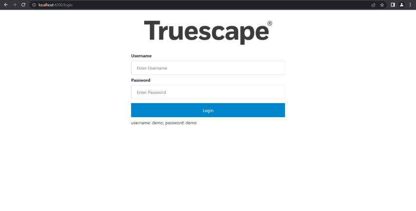

# Truescape

This project was generated with [Angular CLI](https://github.com/angular/angular-cli) version 14.0.0.

## Development server

Run `ng serve` for a dev server. Navigate to `http://localhost:4200/`. The application will automatically reload if you change any of the source files.

## Screens

### Login Page
Username: demo  
Password: demo  

### Pre-mining Stage Page

### Mining Page

### Video Modal

### Carousel Modal

